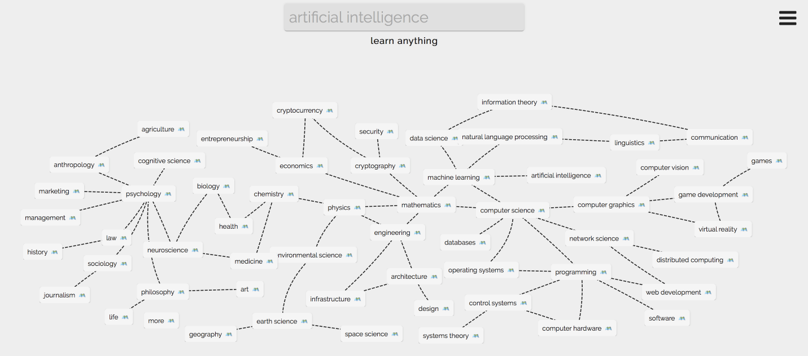

<h1><a href="https://learn-anything.xyz">You can learn anything 🔭</a></h1>

		
	
	
	
  
   
   
  

  

  

  
The image above is an [interactive mind map that can be viewed and explored](https://learn-anything.xyz/learn-anything) as well as [searched through](https://learn-anything.xyz). 🔎

There are **many mind maps inside** which show the **best step by step guides you can use to learn any subject in depth**. 
  
Each node with a link has an emoji attached to show where this node leads on the internet. Nodes with 🗺 link to other mind maps. 

Just search for what you wish to learn or [simply explore](https://learn-anything.xyz/learn-anything).

There is also a video introduction to the website, you can watch [here](https://youtu.be/_zYjS2Uicso).
  
If you think that there is a better way one can learn the subject or you wish something was added or you found a mistake, you can help improve it by clicking the *'impove this map'* button in the bottom right corner of the site. 

The website is also [fully open source](https://github.com/learn-anything/learn-anything) and you can help improve it. 💙

The [main goal of this project](https://github.com/nikitavoloboev/learn-anything/wiki/Future-of-learning) is to **expose human knowledge in avisual and structured way to accelerate learning**. 

For more information, please read our [wiki](https://github.com/learn-anything/maps/wiki) and join our active [Slack channel](https://knowledge-map.slack.com/shared_invite/MTgxNTYzMjIzNjM5LTE0OTQzMzA4MDAtYzY1YWY0ZDc0NQ).

<h1 align="center"><a href="https://knowledge-map.slack.com/shared_invite/MTgxNTYzMjIzNjM5LTE0OTQzMzA4MDAtYzY1YWY0ZDc0NQ">Community 👬</a></h1>

Both this project and the search engine [is in active development](https://github.com/learn-anything/learn-anything). 

If you want to help improve it in any way or want to join an ever growing community of learners, you can join our active [Slack group](https://knowledge-map.slack.com/shared_invite/MTgxNTYzMjIzNjM5LTE0OTQzMzA4MDAtYzY1YWY0ZDc0NQ) where you can either help with expanding content of the mind maps, help with the [development](https://github.com/learn-anything/search-engine) and adding features to the website or you can create a study group for any branch in the mind map and learn together.  

<h1 align="center"><a href="https://github.com/nikitavoloboev/learn-anything/wiki/Contributing-👬">Contributing 👬</a> </a></h1>

We made a [wiki](https://github.com/learn-anything/maps/wiki) that covers [all the different ways](https://github.com/learn-anything/maps/wiki) in which you can help this project evolve and become better. 

In there, you can also find [why we created this website and what problems we are trying to solve](https://github.com/learn-anything/maps/wiki/Future-of-learning-🔭) as well as [our official Roadmap of challenges we have yet to solve](https://github.com/learn-anything/maps/wiki/Roadmap-%F0%9F%9B%A3%EF%B8%8F). 

We use [Slack](https://knowledge-map.slack.com/shared_invite/MTgxNTYzMjIzNjM5LTE0OTQzMzA4MDAtYzY1YWY0ZDc0NQ) for any in-project communication and you can ask any questions you have there.

This project can only become what it is with your help. Thank you. 

<h1 align="center"><a href="https://www.patreon.com/learnanything">Keep this project going 💚</a></h1>

This project is **built by the community, for the community** and in our goals to make the most efficient paths and the best user experience possible in exploring the mind maps and finding the resources you need, we can only rely on donations made by our users to sustain this project.

There are **no advertisements** and **no sponsored content** in this Search Engine as that would defeat our vision of making the best and most optimal learning tracks for learning any topic in the world.
 
We have created a [Patreon page](https://www.patreon.com/learnanything) where you can support our work. Any donation that you make to this project is incredibly valuable to keep this project going. We also have some awesome rewards that come with your support.  

Thank you. 💚

<h1 align="center"><a href="https://learn-anything.netlify.com">Stay in touch 👋</a></h1>

You can follow us on [Twitter](https://twitter.com/learnanything_) where we announce any new awesome changes that were added to the Search Engine.

We also have our own internal [development blog](http://blog.learn-anything.xyz) where we write about interesting challenges we have solved on our way to make the website and curation of Mind Maps the best it can be.

<h1 align="center">Improve our Curated Lists</h1>

With our goal of providing the most efficient paths for Learning Anything, we also manage curation of various GitHub lists. 

Feel free to explore and improve them if you wish. 

- [Books 📚](https://github.com/learn-anything/books) : Free and non free books all can learn from
- [Courses 📝](https://github.com/learn-anything/courses) : Free courses all can learn from
- [Research Papers 📄](https://github.com/learn-anything/research-papers) : Free research papers all can learn from
- [Blogs 🗃️](https://github.com/learn-anything/blogs) : Interesting blogs you can read and gain insights from
- [Humans 👪](https://github.com/learn-anything/humans) : Interesting humans who made a difference
- [Quotes 💬](https://github.com/learn-anything/quotes) : Interesting quotes all can learn from 
- [Websites 🌍 ](https://github.com/learn-anything/websites) : All the interesting websites one can use to learn and do new things
- [Podcasts 🎙](https://github.com/learn-anything/podcasts) : Podcasts all can listen and learn from
- [Newsletters 📮](https://github.com/learn-anything/newsletters) : Free newsletters all can read to get insights from 
- [Images 🎨](https://github.com/learn-anything/images) : User curated image albums
- [Talks 👀](https://github.com/learn-anything/talks) : Interesting talks all can watch
- [Command Line Tools 🐚](https://github.com/learn-anything/command-line-tools) : Command line utilities all can use to learn and do things faster
- [macOS apps 💻](https://github.com/learn-anything/macos-apps) : Best macOS apps all can use to learn and do things faster
- [iOS apps 📱](https://github.com/learn-anything/ios-apps) : Best iOS apps all can use to learn and do things faster
- [Safari Extensions 🌐](https://github.com/learn-anything/safari-extensions) : Awesome Safari Extensions all can use
- [Alfred Workflows 🎩](https://github.com/learn-anything/alfred-workflows) : Alfred workflows all can use to learn and do things faster
- [TV series 🎥](https://github.com/learn-anything/tv-series) : Interesting TV series all can watch
- [Documentaries 🎥](https://github.com/learn-anything/documentaries) : Free and non free documentaries all can learn from
- [Movies 🎥](https://github.com/learn-anything/movies) : Interesting movies all can watch
- [Reddit 🤖](https://github.com/learn-anything/reddit) : All the interesting subreddits all can visit and learn from
- [Youtube 🎥](https://github.com/learn-anything/youtube) : Interesting youtube channels all can learn from 
- [Quora ❓](https://github.com/learn-anything/quora) : All the interesting quora communities one can explore
- [computer games 💻](https://github.com/learn-anything/computer-games) : Interesting computer games one can play in their spare time

<h1 align="center"> Join our team 🚀 </h1>

Join [our Slack channel](https://knowledge-map.slack.com/shared_invite/MTgxNTYzMjIzNjM5LTE0OTQzMzA4MDAtYzY1YWY0ZDc0NQ) and we can discuss ideas together and work on making this vision of visualising and structuring all of world's knowledge a reality. 

Fun fact. 💡 This project started off as a [single mind map](https://www.dropbox.com/s/1rfvd6b0pkoyyko/research-white.png?dl=1) but it grew too big. 

<h2 align="center">Current Team</h2>

<table>
  <tbody>
    <tr>
      <td align="center" valign="top">
        
         
        <a href="https://github.com/nikitavoloboev"> Nikita Voloboev </a>
        
Oversees curation of mind maps

         
        
Curated the entire index of all the mind maps up until this point + helps with making search the best it can be

      </td>
      <td align="center" valign="top">
        
         
        <a href="https://github.com/nglgzz">Angelo Gazzola</a>
        
Lead Web Developer

         
        
Created a complete and working version of the <a href="https://learn-anything.xyz">Search Engine</a> + our own mind map render system as <a href="https://github.com/learn-anything/react-mindmap"> React Component </a>

      </td> 
     </tr>
  </tbody>
</table>

<h2 align="center"><a href="https://github.com/learn-anything/ama">Ask Us Anything 💬</a></h2>

If you have some specific questions about this project our about our team. We would love to hear them and you can ask them either in our [Slack group](https://knowledge-map.slack.com/shared_invite/MTgxNTYzMjIzNjM5LTE0OTQzMzA4MDAtYzY1YWY0ZDc0NQ) or [in our GitHub AMA](https://github.com/learn-anything/ama/issues/new). 

<h1 align="center"> <a href="https://github.com/nikitavoloboev/learn-anything/stargazers">🌟 gazers</a> over time</h1>

	

<h2 align="center"> Thank you 💙 </h2>

- to [MindNode](https://mindnode.com/) who created [the application](https://itunes.apple.com/app/id992076693?mt=12&ign-mpt=uo%3D4) that makes this all possible and for providing the [incredible web service](https://my.mindnode.com/) to share these mind maps
- to all the people who contributed to this project and this vision of liberating and visualising knowledge in this unique way

